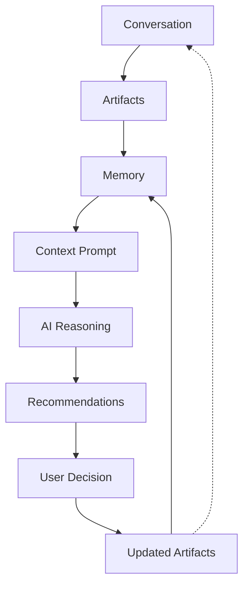

# Tai AI Architecture

Conceptual architecture for Tai’s coaching intelligence.

This document explains **responsibilities and boundaries**. It is not an implementation guide: no APIs, schemas, file paths or module layouts.

Related: `Docs/README.md`, `Docs/TAI_MANIFESTO.md`, `Docs/PRODUCT_PRINCIPLES.md`, `Docs/PRODUCT_DECISIONS.md`.

---

## 1. Purpose

Tai is an AI health and performance coach. Users talk, confirm and correct. The system turns that into durable knowledge and timely recommendations.

The architecture separates:

| Concern | Responsibility |
|---------|----------------|
| Interaction | Conversation |
| Truth | Structured artifacts |
| Continuity | Memory and archives |
| Reasoning input | Context prompts |
| Guidance | Recommendations with Evidence and Confidence |
| Authority | User decisions |

Nothing in this stack is optional conceptually. Skipping a layer collapses coaching into either a chatbot-with-no-memory or a tracker-with-no-guidance.

---

## 2. Core loop

```text
Conversation
     ↓
Artifacts
     ↓
Memory
     ↓
Context Prompt
     ↓
AI Reasoning
     ↓
Recommendations
     ↓
User Decision
     ↓
Updated Artifacts
     ↺ (feeds Memory and future Context Prompts)
```



Home briefings and proactive notifications consume the same recommendation layer. They do not invent a parallel truth path.

---

## 3. Layer responsibilities

### Conversation

The interaction layer. The user and Tai exchange messages, cards, attachments and quick actions inside one active thread.

**Owns:** turn-taking, clarification, tone, presenting suggestions for review.

**Does not own:** durable domain records, silent writes to persistence, or being the long-term database.

Conversation is dialogue and interaction history — not source of truth.

### Artifacts

Confirmed, structured records outside the chat: meals, goals, workout programs, sessions, preferences and other domain objects.

**Owns:** what is true *now* for coaching and Home.

**Does not own:** free-form chat history or speculative AI drafts.

Feature modules produce and update artifacts after user confirmation (or equivalent explicit acceptance). Artifacts are typed, queryable and correctable.

### Memory

Learned continuity: preferences, corrections, reusable patterns (e.g. Meal Memory), and compact knowledge distilled from past interaction.

**Owns:** what Tai should *remember* to reduce friction and personalise coaching.

**Does not own:** replacing artifacts as facts, or storing full transcripts as the primary recall mechanism.

Memory is visible, correctable and deletable in product terms. It improves interpretation and recommendations; it does not silently override confirmed artifacts.

### Context Prompt

A curated package assembled for a reasoning turn: relevant artifacts, memory slices, archive-derived context, current state (e.g. today’s briefing signals) and the active user ask.

**Owns:** what the model is allowed to see for *this* decision.

**Does not own:** inventing facts, or persisting itself as truth.

Context prompts are disposable inputs. They must be grounded in artifacts and authorised memory — not in unverified chat alone.

### AI Reasoning

Model inference over the context prompt: interpretation, explanation, planning suggestions, progression ideas, ambiguity handling.

**Owns:** proposing interpretations and recommendations with stated uncertainty.

**Does not own:** mutating user data, confirming facts, or bypassing the user when confirmation is required.

AI suggests. Humans decide.

### Recommendations

Actionable outputs of reasoning: “do this next,” “interpret this meal as…,” “suggest +2.5 kg on the next set,” with reason, Evidence and Confidence.

**Owns:** explainable guidance surfaces (Home, Tai, notifications, confirmation cards).

**Does not own:** auto-applying changes to programs, meals or goals.

A Recommendation without Evidence and Confidence is incomplete.

### User Decision

Confirm, correct, dismiss, refine or ignore.

**Owns:** authority over important state changes.

**Does not own:** inventing domain structure — decisions map onto artifact updates.

### Updated Artifacts

The closed loop. Accepted User Decisions write new or revised Artifacts; corrections update Memory where appropriate; future Context Prompts reflect the new truth.

---

## 4. Concept distinctions

| Concept | What it is | What it is not |
|---------|------------|----------------|
| **Conversation** | Active dialogue and interaction evidence | The database or source of truth |
| **Artifact** | Confirmed structured domain record | A chat message or raw model dump |
| **Memory** | Distilled, correctable continuity that personalises future behaviour | A second copy of every artifact, or hidden silent state |
| **Archive** | Closed Conversation packaged as Raw Archive + Human Summary + AI Context Prompt + Structured Artifacts | The live thread or a substitute for the Artifact store |
| **Human Summary** | User-facing recap of a closed Conversation | The AI Context Prompt or source of truth |
| **AI Context Prompt** | Compact model-oriented distillation from an Archive for future turns | The per-turn assembled Context Prompt, or durable truth |
| **Context Prompt** | Assembled reasoning input for a turn | Durable truth or a full transcript replay |
| **Recommendation** | Propose-next guidance with reason | An applied change to user data |
| **Evidence** | Specific inputs cited for a recommendation (artifacts, signals, memory, user statements) | Vague vibe or ungrounded persuasion |
| **Confidence** | Explicit uncertainty / quality of the recommendation or interpretation | Fake precision or absolute certainty theatre |

### Conversation vs artifact

Conversation asks and negotiates. Artifacts record what was confirmed. “I had oats and eggs” in chat is evidence; a confirmed meal log is an artifact.

### Artifact vs memory

Artifacts are current facts (“today’s lunch,” “current program”). Memory is reusable learning (“user’s usual oat bowl,” “always corrects chicken portions upward”). Memory may *point at* artifacts; it must not pretend to replace them.

### Archive vs Context Prompt

An Archive is a closed historical package (Raw Archive, Human Summary, AI Context Prompt, Structured Artifacts). A Context Prompt is a fresh assembly for the next turn — often including an AI Context Prompt derived from Archives, plus live Artifacts and Memory.

### Recommendation vs evidence vs confidence

- **Recommendation** — what Tai suggests doing or accepting.
- **Evidence** — why: which meals, goals, sets, signals or memories support it.
- **Confidence** — how sure Tai is, and what is unknown.

Users should be able to open “why” and see Evidence and unknowns, not only a slogan.

---

## 5. AI Decision Hierarchy

Whenever Tai reasons about user information, sources must be respected in this order of precedence. Higher authority always wins over lower authority when they conflict.

### 1. Confirmed Artifacts

Highest authority.

Examples:

- Confirmed meals
- Confirmed workouts
- Confirmed goals
- Confirmed workout plans

These are user-accepted structured records. Reasoning may cite them, explain them and recommend changes to them — it must not silently overwrite them.

### 2. Trusted Integrations

Examples:

- Apple Health
- Future connected devices

Authorised external signals outrank Memory, Conversation and Inference when they are the agreed source for that metric (for example sleep and weight). They still do not silently overwrite Confirmed Artifacts that represent user-owned plans or logs unless product policy explicitly merges them through a User Decision.

### 3. User Explicit Statements

Information directly provided by the user during the current Conversation.

Explicit statements guide the current turn and may become Artifacts after confirmation. Until confirmed, they inform Recommendations; they do not automatically become durable truth.

### 4. Long-Term Memory

Stable learned preferences and persistent facts (including Meal Memory and similar continuity).

Memory personalises interpretation and Recommendations. It must never silently override Confirmed Artifacts, Trusted Integrations or a clearer explicit user statement in the active Conversation.

### 5. Active Conversation Context

Information from the current Conversation that has not yet become Confirmed Artifacts — drafts, clarifications, exploratory talk and unconfirmed interpretations.

Useful for coherence within the thread. It sits below explicit user statements (level 3) and below established Long-Term Memory (level 4). It must not be treated as durable truth.

### 6. AI Inference

Lowest authority.

Assumptions, guesses and model completions. AI Inference may propose Recommendations with Evidence and Confidence. It must never overwrite confirmed information automatically.

### Why this hierarchy exists

Tai combines many inputs of unequal reliability. Without precedence, Inference can invent “facts,” Memory can ossify errors, and Conversation can blur what was actually confirmed.

Higher-authority sources take precedence so that:

- Confirmed Artifacts remain the source of truth
- Trusted Integrations are preferred over duplicate manual entry where decided
- Users stay in control of what becomes durable
- Recommendations stay explainable — Evidence should cite the highest applicable authority
- Lower layers fill gaps; they do not defeat higher ones

Archive-derived AI Context Prompts are continuity aids assembled into the Context Prompt. They inherit this hierarchy: they inform reasoning but do not outrank newer Confirmed Artifacts or Trusted Integrations.

---

## 6. From Conversation to Archive

Tai keeps **one active Conversation**. When the user archives it (or the product closes a thread under the same policy), archiving produces a conceptual **Archive package**:

```text
Active Conversation
        │
        ▼
   Archive event
        │
        ▼
   Archive package
   ├── 1. Raw Archive
   ├── 2. Human Summary
   ├── 3. AI Context Prompt
   └── 4. Structured Artifacts
```

### What archiving means

1. The live thread is closed; a new active Conversation may start.
2. **Raw Archive** preserves the Conversation history.
3. **Human Summary** is produced for the user.
4. **AI Context Prompt** is produced for future Context Prompt assembly.
5. **Structured Artifacts** are generally already persisted before archiving. They are not generated by archiving. They are part of the Archive package because they represent the durable facts created during that Conversation. The Artifact store remains the source of truth — the Archive does not become their database.

Conversation history is not erased by archiving — it changes role from *active interaction* to *historical Archive*.

---

## 7. What the Archive package contains

### 1. Raw Archive

Full Conversation history for audit, deep recall and export.

**Audience:** system / user export.

### 2. Human Summary

A readable recap for the user: what was discussed, what was decided, what changed.

**Audience:** human.

**Purpose:** trust, review, continuity without re-reading the whole thread.

### 3. AI Context Prompt

A compact, model-oriented distillation of what future coaching must not forget from that period: goals in play, preferences stated, open loops, important corrections, pointers to relevant Artifacts.

**Audience:** future AI Reasoning (via Context Prompt assembly).

**Purpose:** continuity without replaying the full transcript every turn.

### 4. Structured Artifacts

Confirmed domain records created during the Conversation (meals, goals, plans, sessions, and so on).

**Audience:** product truth layer.

**Clarification:** Structured Artifacts are generally already persisted before archiving. They are not generated by archiving. They are considered part of the Archive package because they represent the durable facts created during that Conversation.

```text
Archive package
├── Raw Archive            → audit / deep recall / user export
├── Human Summary          → user-facing history
├── AI Context Prompt      → injected into future Context Prompts
└── Structured Artifacts   → source of truth (already persisted; included in package)
```

---

## 8. How AI Context Prompts are used later

When a new active Conversation (or Home briefing / proactive nudge) needs reasoning:

```text
Live Artifacts
     +
Authorised Memory
     +
AI Context Prompt(s) from Archives
     +
Current user turn / briefing need
     │
     ▼
Assembled Context Prompt
     │
     ▼
AI Reasoning → Recommendation
```

Assembly must respect the AI Decision Hierarchy.

Rules of use:

- Archive-derived AI Context Prompts **inform** reasoning; they do not override newer Artifacts.
- If an AI Context Prompt conflicts with a Confirmed Artifact, the **Artifact wins**.
- Context Prompt assembly may omit stale Archive prompts; freshness and relevance beat volume.
- Users must remain able to correct Memory and Artifacts so future Context Prompts stay honest.

---

## 9. Why structured Artifacts are always the source of truth

1. **Queryability** — Home, workouts and notifications need typed state, not paragraph search.
2. **Correction** — undo, edit and delete require stable records.
3. **Safety** — progression, deficits and load suggestions must rest on confirmed data.
4. **Integration** — Apple Health and other signals join the same fact layer, not the Conversation.
5. **Honesty** — Conversation can be ambiguous, partial or exploratory; Artifacts are what the user accepted.

Therefore: Conversation may *propose* a meal or program change; only an Artifact update after User Decision makes it true for Tai.

---

## 10. Why the Conversation engine must stay domain-agnostic

The Conversation engine is the reusable interaction substrate: turns, cards, attachments, confirmation patterns, Archive lifecycle, Context Prompt assembly hooks.

Domain logic belongs in **capability modules** (nutrition, workout, recovery, …) that:

- interpret domain-specific input,
- produce domain Artifacts,
- contribute Memory of the right shape,
- expose Recommendation types and Evidence.

If the Conversation engine hard-codes “meal” or “set,” every new capability forks the chat stack. If capabilities plug in through Artifacts, Recommendations and Memory contributions, Tai stays one coach with many skills.

```text
┌─────────────────────────────────────────┐
│         Conversation engine             │
│  (domain-agnostic interaction + loop)   │
└───────────────┬─────────────────────────┘
                │ proposes / confirms via
                ▼
┌─────────────────────────────────────────┐
│     Capability modules (plugins)        │
│  Nutrition │ Workout │ Recovery │ …     │
│         → produce Artifacts             │
│         → contribute Memory             │
│         → shape Recommendations         │
└─────────────────────────────────────────┘
```

---

## 11. How future capabilities plug in

Each capability adds **Artifact types**, **Memory contributions**, **Evidence sources** and **Recommendation kinds**. It does not add a parallel Conversation product.

| Capability | Plugs in as | Notes |
|------------|-------------|--------|
| **Nutrition** | Meal Artifacts, Meal Memory, interpretation Recommendations | First capability; reference pattern for confirm-before-save |
| **Workout** | Program / session / set Artifacts; progression Recommendations | Import-first; AI suggests progression, never silently edits programs |
| **Recovery** | Recovery-related Artifacts and briefing inputs | Builds on sleep/health signals when available; no fake precision |
| **Restaurant recommendations** | Contextual Recommendations using location + preferences + nutrition state | Future, privacy-sensitive; same recommend → User Decision → Artifact/Memory path |
| **Apple Health** | Health signal Artifacts / inputs into Context Prompt and Evidence | Preferred source for sleep, weight and related metrics; no manual sleep/weight logging workflows |

Shared contract for every capability:

```text
Input (user / sensor / import)
    → AI interpretation or heuristic (optional)
    → Recommendation + Evidence + Confidence
    → User Decision
    → Artifact (± Memory update)
    → Future Context Prompts
```

Capabilities may surface on **Home** (briefing) or **Tai** (Conversation) without new primary tabs.

---

## 12. Architectural Rules

1. **Conversation never writes directly to persistence.** Turns may stage intent; feature modules / Artifact writers persist after explicit acceptance where required.
2. **Feature modules produce Artifacts.** Domain truth is created in capability boundaries, not inside generic chat storage.
3. **AI never directly mutates user data.** Models propose; application code applies only after policy and User Decision.
4. **AI Recommendations require explicit confirmation where appropriate.** Especially meals, goals, program changes and progression that alters the plan.
5. **The Conversation engine must remain reusable.** No domain-hard-coded chat core; capabilities plug in.
6. **Structured Artifacts are the source of truth.** Summaries, Memory and Context Prompts are subordinate.
7. **Conversation is not the database.** Archives and transcripts are history and continuity aids.
8. **Memory is visible, correctable and deletable.** Hidden irreversible learning is not allowed.
9. **Every Recommendation carries Evidence and Confidence.** Unexplained or falsely precise guidance is incomplete.
10. **Archive-derived context informs; it does not override newer Artifacts.**
11. **Prefer Trusted Integrations over duplicate manual entry** for health metrics (e.g. Apple Health for sleep and weight).
12. **Proactive surfaces use the same Recommendation layer** as Conversation — no shadow logic path.
13. **Safety and user control outrank engagement.** Dismissal, correction and quiet controls are first-class.
14. **New capabilities extend the loop; they do not bypass it.**
15. **Reasoning must respect the AI Decision Hierarchy.** Higher-authority sources always take precedence over lower ones.
16. **Every AI-generated Artifact must be traceable back to the Conversation and User Decision that created it.** Traceability is essential for explainability, debugging, user trust, auditing and future correction. Tai should always be able to explain where important information originated.

---

## 13. Non-goals of this document

- Concrete prompt templates, token budgets or model providers
- Swift module maps, SwiftData schemas or Worker routes
- UI layout for Home vs Tai

Those belong in implementation and product surface docs. This document defines the conceptual contract those designs must honour.
